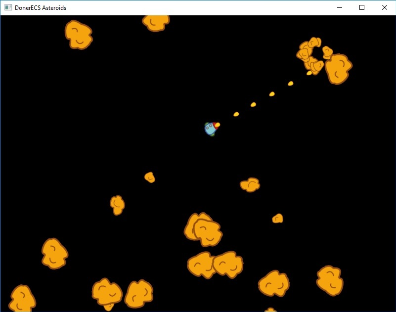

# DonerComponents_Asteroids_Example
Asteroids clone based on **[DonerComponents](https://github.com/Donerkebap13/DonerComponents)** (Doner Entity Component System) and **[SFML](https://github.com/SFML/SFML)** libraries.



## Downloading

You can acquire stable releases [here](https://github.com/Donerkebap13/DonerComponents/releases).

Alternatively, you can check out the current development version with:

```
git clone https://github.com/Donerkebap13/DonerComponents.git
```
After checking out, run ``git submodule update --init --recursive``.

Also run ``git config --system core.longpaths true`` if you have any problem with path length.

## What could you find in this example
- A very simple game engine built using **SFML**
- **DonerComponents** system [initialization](https://github.com/Donerkebap13/DonerComponents_Asteroids_Example/blob/master/engine/source/common/application/CApplicationBase.cpp#L91), [update](https://github.com/Donerkebap13/DonerComponents_Asteroids_Example/blob/master/engine/source/common/application/CApplicationBase.cpp#L133) and [destruction](https://github.com/Donerkebap13/DonerComponents_Asteroids_Example/blob/master/engine/source/common/application/CApplicationBase.cpp#L145)

- [New component registration](https://github.com/Donerkebap13/DonerComponents_Asteroids_Example/blob/master/engine/source/common/application/CApplicationBase.cpp#L157)
- [Tags](https://github.com/Donerkebap13/DonerComponents_Asteroids_Example/blob/master/asteroids/source/common/application/CApplication.cpp#L56) and [Prefabs](https://github.com/Donerkebap13/DonerComponents_Asteroids_Example/blob/master/asteroids/source/common/application/CApplication.cpp#L59) registration
- [Component Serialization info](https://github.com/Donerkebap13/DonerComponents_Asteroids_Example/blob/master/engine/include/engine/components/CCompSprite.h#L67) definition
- [Custom serialization types](https://github.com/Donerkebap13/DonerComponents_Asteroids_Example/blob/master/engine/include/engine/serialization/EngineSerialization.h#L38) definition
- [Messaging system](https://github.com/Donerkebap13/DonerComponents_Asteroids_Example/blob/master/asteroids/source/common/components/CCompBulletCollider.cpp#L42) usage
